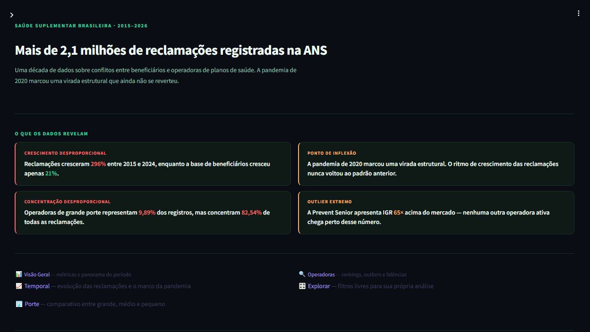
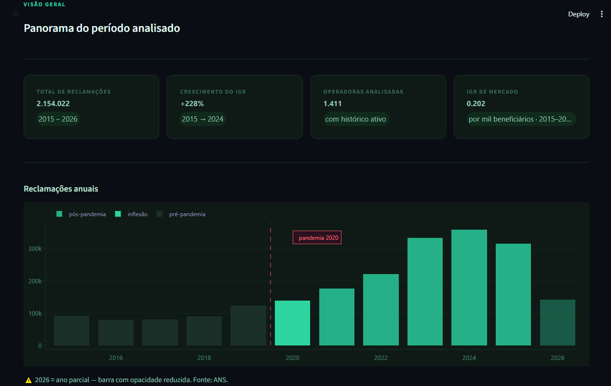
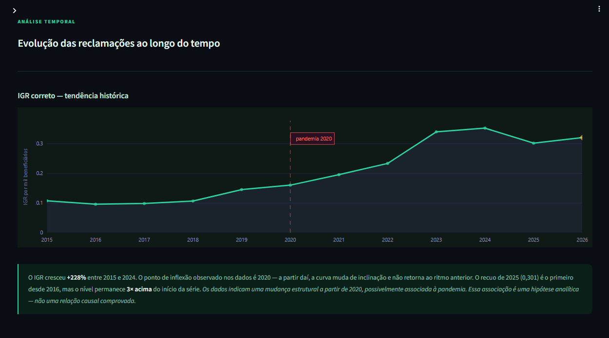
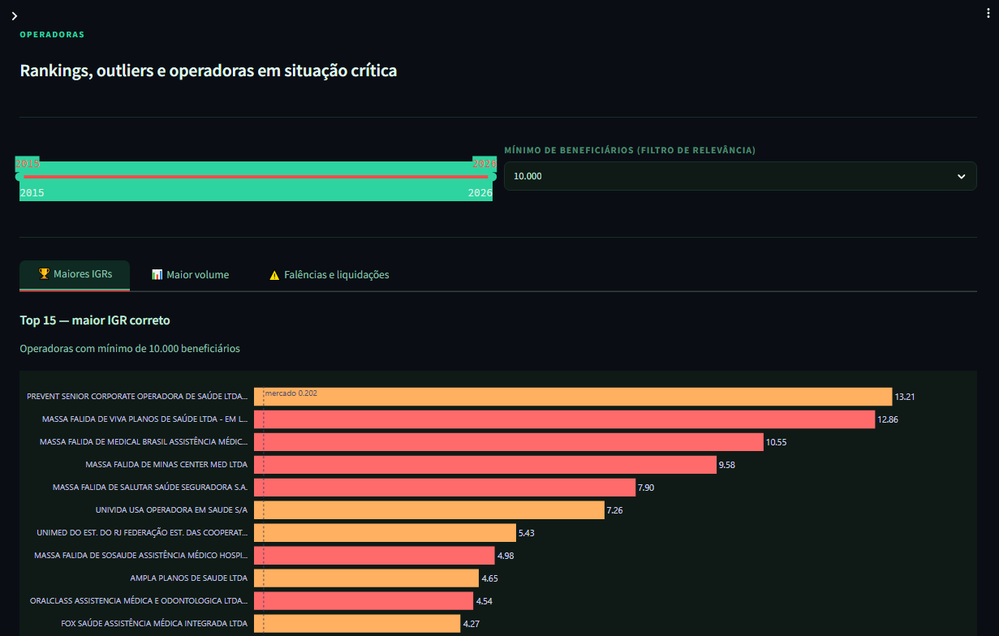
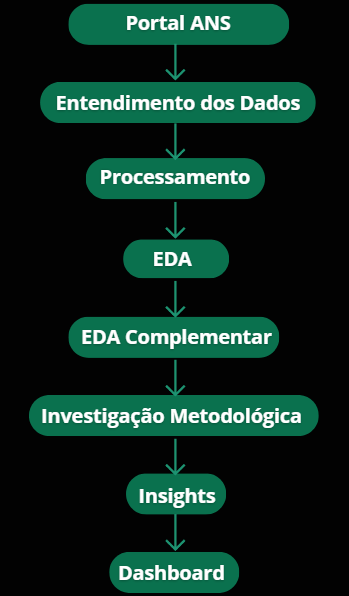

<div align="center">

# 🏥 ANS Complaints Insights

### Data Storytelling sobre reclamações de planos de saúde no Brasil


**[🚀 Acessar o Dashboard ao Vivo](https://huggingface.co/spaces/marinizeeng/ans-complaints-insights)**

</div>

---

## 📖 Sobre o Projeto

Este projeto nasceu de uma pergunta simples:

> **As reclamações dos beneficiários de planos de saúde cresceram porque aumentou o número de pessoas com plano — ou há algo mais grave acontecendo?**

A resposta está nos dados.

Entre 2015 e 2024, a base de beneficiários cresceu **21%**. As reclamações cresceram **296%**. E a pandemia de 2020 foi o **ponto de inflexão** que mudou a trajetória do setor de forma estrutural — sem retorno ao ritmo anterior.

O projeto percorre todo o ciclo analítico: da coleta e processamento dos dados brutos da ANS até a construção de um dashboard interativo de Data Storytelling, passando por análise exploratória aprofundada, correção de metodologia de cálculo do IGR, descoberta de insights e documentação rigorosa de todas as hipóteses investigadas.

---

## 📌 O que este projeto entrega

Além da construção do dashboard, o projeto contempla todas as etapas de um fluxo analítico completo:

- entendimento da base de dados;
- limpeza e padronização;
- investigação metodológica;
- análise exploratória (EDA);
- validação de hipóteses;
- descoberta de insights;
- construção de Data Storytelling;
- disponibilização em produção.

Durante o desenvolvimento foi identificada e corrigida uma inconsistência importante na forma de calcular o IGR médio, garantindo que todas as análises utilizassem a metodologia estatisticamente correta.

---

## 🖥️ Demonstração

### Página Inicial



### Visão Geral — métricas e panorama do período



### Temporal — o marco da pandemia de 2020



### Operadoras — rankings e outliers



---

## 🔍 Principais Descobertas

### 📌 A pandemia como ponto de inflexão estrutural
Antes de 2020, o crescimento das reclamações era lento e irregular. A partir de 2020, a curva muda de inclinação e **não retorna ao ritmo anterior** — sugerindo que o sistema de saúde suplementar saiu estruturalmente fragilizado do período pandêmico.

### 📌 Grande porte concentra desproporcionalmente
Operadoras de grande porte representam apenas **9,89%** dos registros na base, mas concentram **82,54%** de todas as reclamações — razão de concentração de **8,35×**.

### 📌 Tamanho da carteira não explica tudo
A correlação entre quantidade de beneficiários e reclamações é moderada (**0,54**). Operadoras com carteiras semelhantes apresentam comportamentos completamente distintos — fatores operacionais e de qualidade de atendimento exercem papel relevante.

### 📌 Assistência médica vs odontológica
O IGR da assistência médica é **27 vezes** maior que o da cobertura exclusivamente odontológica — proporção que se manteve estável ao longo de toda a série histórica.

### 📌 Prevent Senior — outlier entre operadoras ativas
IGR de **13,21** — **65 vezes** acima do IGR de mercado (0,202). Única operadora ativa nesse patamar, com comportamento completamente distinto das demais grandes operadoras.

### 📌 Operadoras em falência continuam impactando beneficiários
68 operadoras identificadas com indícios de falência ou liquidação. O padrão sugere que a deterioração do serviço começa **antes** da falência formal.

### 📌 Inversão histórica em 2026
Pela primeira vez na série, o porte médio (IGR 0,358) superou o grande porte (IGR 0,319). Comportamento monitorado — 2026 é ano parcial.

---

## Fluxo Analítico



---

## ⚠️ Descoberta Metodológica Importante

Durante a EDA surgiu uma inconsistência nos resultados.

Os valores anuais do IGR estavam completamente fora da realidade.

> Esta foi a descoberta técnica mais relevante do projeto e impacta diretamente a confiabilidade de qualquer análise sobre o IGR.

A coluna `IGR` do dataset da ANS já contém o índice **calculado individualmente** para cada operadora. Calcular a média aritmética desse campo ignora o tamanho de cada carteira, produzindo valores completamente distorcidos.

**❌ Método incorreto — média simples:**
```python
df.groupby("competencia")["igr"].mean()
# Produz valores como 357 em 2022 — matematicamente inválido
```

**✅ Método correto — adotado neste projeto:**
```python
igr_correto = (
    df.groupby("competencia")
    .agg(
        total_reclamacoes=("qtd_reclamacoes", "sum"),
        total_beneficiarios=("qtd_beneficiarios", "sum")
    )
)
igr_correto["igr"] = (
    igr_correto["total_reclamacoes"]
    / igr_correto["total_beneficiarios"]
    * 1000
)
```

**Fórmula do IGR:** `IGR = (QTD_RECLAMACOES / QTD_BENEFICIARIOS) × 1.000`

---

## 🗂️ Estrutura do Projeto

```
ans-complaints-insights/
│
├── app/                          # Módulo do dashboard
│   ├── __init__.py
│   ├── data_loader.py            # Carregamento, cache e agregações
│   └── styles.py                 # CSS global e layout Plotly (tema Teal)
│
├── data/
│   ├── raw/                      # Dataset bruto da ANS (.gitignore)
│   └── processed/
│       └── igr_processed.csv     # Dataset processado (Git LFS)
│
├── docs/                         # Documentação analítica completa
│   ├── data_understanding_report.md
│   ├── investigacao_inicial.md
│   ├── insights_iniciais.md
│   ├── hypotheses.md
│   └── perguntas_negocio.md
│
├── images/                       # Screenshots do dashboard
│
├── pages/                        # Páginas do dashboard Streamlit
│   ├── 1_Visão_Geral.py
│   ├── 2_Temporal.py
│   ├── 3_Porte.py
│   ├── 4_Operadoras.py
│   └── 5_Explorar.py
│
├── src/                          # Scripts de análise
│   ├── data_understanding.py     # Etapa 1 — entendimento da base
│   ├── process_igr.py            # Etapa 2 — processamento e limpeza
│   ├── exploratory_analysis.py   # Etapa 3 — EDA principal
│   └── eda_complementar.py       # Etapa 3B — EDA com IGR correto
│
├── tests/
│   └── test_dados.py             # Testes de regras de negócio
│
├── .github/
│   └── workflows/
│       └── main.yml              # Pipeline CI/CD — pytest automático
│
├── Dockerfile                    # Deploy no Hugging Face Spaces
├── main.py                       # Ponto de entrada do Streamlit
└── requirements.txt
```

---

## 🚀 Como Executar Localmente

**Pré-requisitos:** Python 3.11+

```bash
# Clone o repositório
git clone https://github.com/marinizedev/ans-complaints-insights.git
cd ans-complaints-insights

# Crie e ative o ambiente virtual
python -m venv .venv

# Windows
.venv\Scripts\activate

# Linux/Mac
source .venv/bin/activate

# Instale as dependências
pip install -r requirements.txt

# Execute o dashboard
streamlit run main.py
```

---

## 🧪 Testes

```bash
pytest tests/
```

O pipeline de CI/CD executa os testes automaticamente a cada push via **GitHub Actions**.

---

## 📊 Fonte dos Dados

| Item | Detalhe |
|---|---|
| **Origem** | [Portal de Dados Abertos da ANS](https://dadosabertos.ans.gov.br/FTP/PDA/IGR) |
| **Dataset** | Índice Geral de Reclamações (IGR) |
| **Período** | 2015 a 2026 |
| **Registros** | 151.501 |
| **Operadoras** | 1.411 únicas |
| **Cobertura** | Assistência médica e exclusivamente odontológica |

---

## 🛠️ Stack Tecnológica

| Camada | Tecnologia |
|---|---|
| Linguagem | Python 3.11 |
| Dashboard | Streamlit 1.45 |
| Visualização | Plotly 5.24 |
| Análise de Dados | Pandas 2.2 |
| Testes | pytest 8.3 |
| CI/CD | GitHub Actions |
| Containerização | Docker |
| Deploy | Hugging Face Spaces |
| Versionamento de arquivos grandes | Git LFS |

---

## 👩‍💻 Sobre

Projeto desenvolvido por **Marinize Santana** como parte do portfólio de Data Engineering e Analytics Engineering.

Estudante de Análise e Desenvolvimento de Sistemas na UniFECAF, com foco em construir soluções analíticas baseadas em problemas reais.

<div align="center">

[](https://linkedin.com/in/marinize-santana-47bb2b372)
[](https://github.com/marinizedev)
[](https://huggingface.co/spaces/marinizeeng/ans-complaints-insights)

</div>
